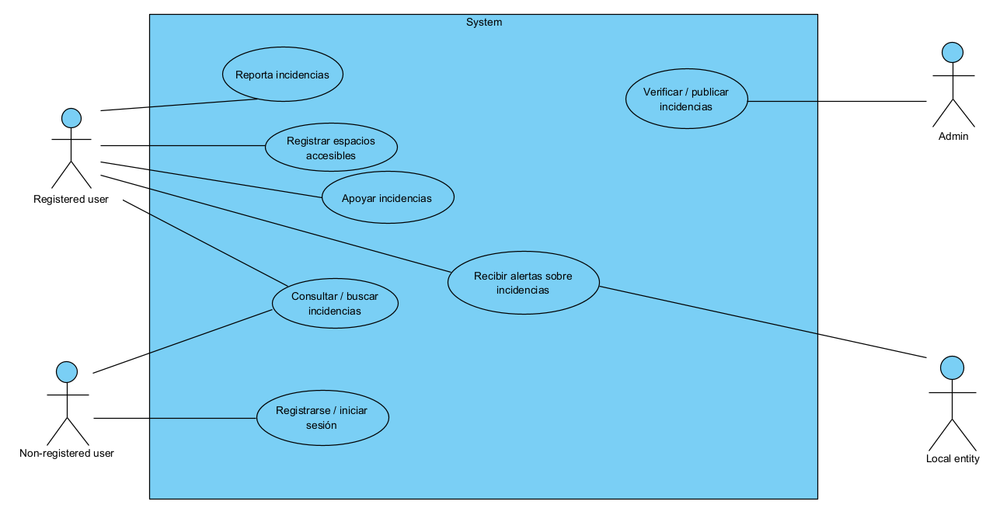
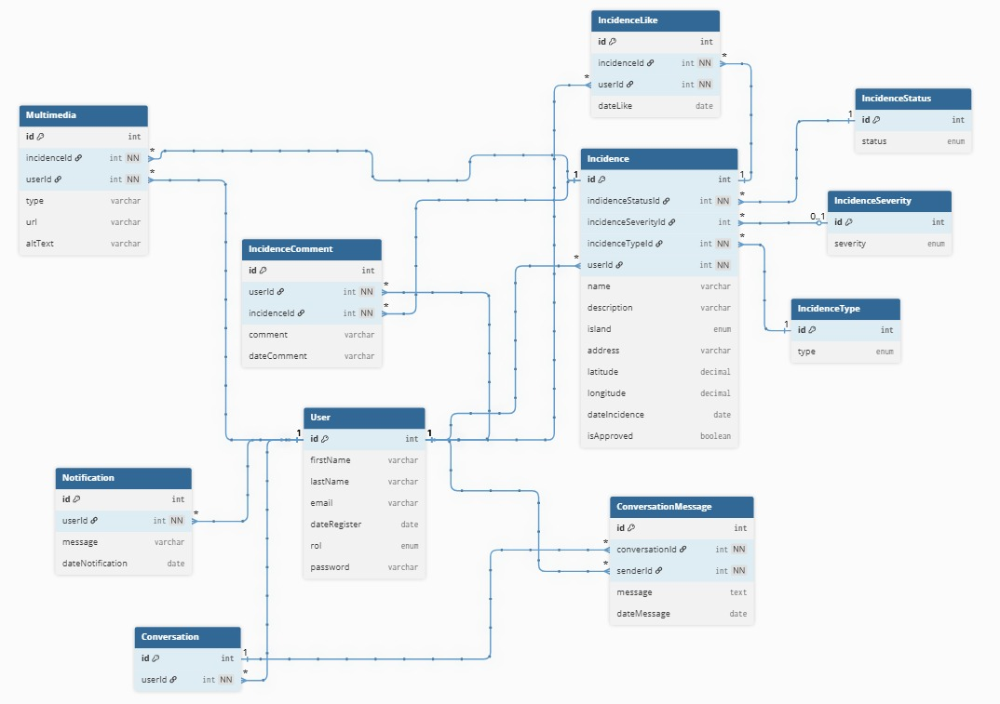

# CANACCESIBLE

## Description

**CanAccesible** is a Canary Islands web platform that enables citizens to:

- **Report accessibility incidents** in public or private spaces.
- **Share accessibility best practices** to inspire and improve inclusion.

The project aims to promote a **more accessible society** and awareness of the needs of all people, combining modern and accessible design with easy-to-use tools for the community.

## Main Technologies

- **Frontend:** 
- **Styles:** 
- **Backend:** 
- **ORM:** 
- **Database:** 
- **Version Control:** 
- **API Endpoint Management:** 

### Additional Technologies

- **React-Router-Dom:** Library for managing routes and navigation within the React application dynamically.
- **Axios:** HTTP client for making requests to the backend, handling APIs and receiving responses easily.
- **BCrypt:** Library for encrypting passwords and securing sensitive user information.
- **Motion (Framer Motion):** Library for animations and smooth transitions in React components, improving user experience.

## Project Structure

```
frontend/
├── public/
├── src/
│ ├── assets/ # Images, logos, ...
│ ├── components/
│ ├── pages/
│ ├── services/ # API call logic
│ ├── App.jsx
│ └── index.js
└── package.json # Frontend dependencies and scripts

backend/
├── config/ # Server and DB configuration
├── controllers/ # Route controllers
├── migrations/ # Database migrations
├── models/ # Sequelize models
├── routes/ # Route definitions
├── seeders/ # Initial DB data
├── db.js # Main database connection
└── package.json # Backend dependencies and scripts

docs/ # Documentation, diagrams, or additional resources
```

## Use Case Diagram



## Entity-Relationship Diagram



## Project Installation

### Prerequisites

- Have NodeJS, NPM, and MySQL installed.

### Clone Repository

```
git clone https://github.com/devcarlosperez/CanAccesible
```

### Backend Configuration

- Enter the backend directory

```
cd backend
```

- Install dependencies

```
npm install
```

- Run migrations and seeders

```
NODE_ENV=development npx sequelize-cli db:migrate

NODE_ENV=development npx sequelize-cli db:seed:all
```

- Start backend

```
node index.js
```

### Frontend Configuration

```
cd frontend

npm install

npm run dev
```

## Links

- **API Documentation in Postman:** [Access here](https://documenter.getpostman.com/view/48689306/2sB3Wnxhsu)

## Authors

- Jonathan Morera Apaza
- Carlos Pérez Santana
- Iriome Matos González
