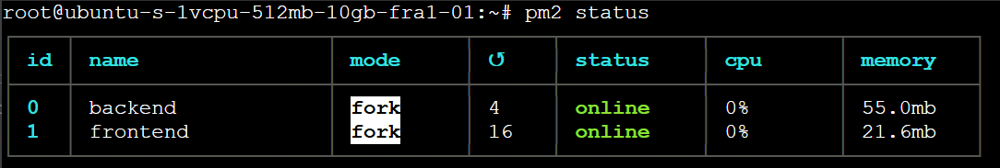

# Deployment

## DigitalOcean

DigitalOcean is a cloud infrastructure provider that offers scalable and developer-friendly computing solutions. They provide virtual servers (Droplets), managed databases, object storage (Spaces), and private networks.

**Key features:**
- Easy-to-use control panel
- Competitive pricing
- Excellent community support
- Integration with popular tools

---

## Droplet / PM2

We cloned the CanAccesible repository on a **DigitalOcean Droplet** (VPS with Ubuntu 24.04 LTS). We installed **PM2** to keep both frontend and backend running 24/7.



**Frontend setup:**
```bash
pm2 start "npm run dev -- --host 0.0.0.0" --name frontend
```

**Backend setup:**
```bash
pm2 start "NODE_ENV=production node index.js" --name backend
```

PM2 handles:
- Automatic app restart if they crash
- Maintains a log history
- Automatic restart on server reboot

---

## Database

We host the **MySQL** database on DigitalOcean as a managed service. This provides:
- Automatic backups
- Easy scalability
- No server maintenance
- Firewall configured only for connections from the Droplet

---

## Spaces Storage

DigitalOcean Spaces is object storage similar to AWS S3. We use it to store all images uploaded through the CRUDs:

- **Multer** handles uploads from the backend
- Images are stored in Spaces (Frankfurt region)
- Automatic deletion on record update or deletion
- Public URLs for frontend display

**Image lifecycle:**
- **Upload**: Images are sent to Spaces via Multer
- **Update**: Old images are deleted, new ones are uploaded
- **Delete**: Images are removed when a record is deleted

---

## Architecture

```
┌──────────────────────────────┐
│  DigitalOcean Droplet        │
├──────────────────────────────┤
│ Frontend (React/Vite) - PM2  │
│ Backend (Node.js/Express)    │
│ Nginx (Reverse Proxy)        │
└────────────┬─────────────────┘
             │
        ┌────┴────────────┐
        │                 │
    ┌───▼──────┐    ┌─────▼──────┐
    │ MySQL DB │    │   Spaces   │
    │(Managed) │    │  (Images)  │
    └──────────┘    └────────────┘
```

---

## Tech Stack

| Layer | Technology |
|-------|-----------|
| Frontend | React + Vite |
| Backend | Node.js + Express + Sequelize |
| Database | MySQL 8.0 |
| Process Manager | PM2 |
| Reverse Proxy | Nginx |
| Image Storage | DigitalOcean Spaces |
| File Upload | Multer |

---

## Monthly Costs

| Service | Description | Price |
|---------|-------------|-------|
| Droplet | Frontend + Backend + PM2 | $5-20 |
| MySQL Database | Application data | $15-50 |
| Spaces (5GB) | Image storage | $5 |
| **Total** | **Complete infrastructure** | **~$25-75** |

---

## Useful Commands

```bash
# View application status
pm2 status

# View logs in real-time
pm2 logs

# Restart application
pm2 restart backend

# Live monitoring
pm2 monit

# Update code and restart
cd ~/CanAccesible
git pull origin main
cd frontend && npm install && npm run build
cd ../backend && npm install && npm run migrate
pm2 restart all
```

---

## References

- [DigitalOcean Docs](https://docs.digitalocean.com)
- [PM2 Docs](https://pm2.keymetrics.io)
- [Nginx Docs](https://nginx.org/en/docs)
