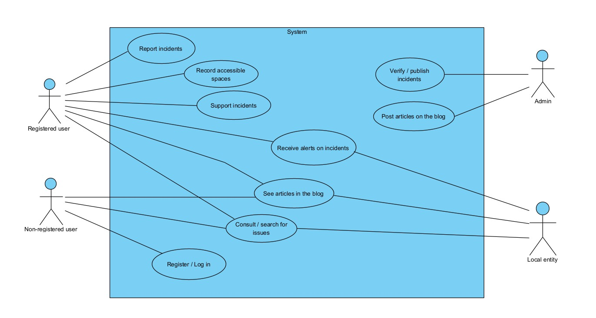
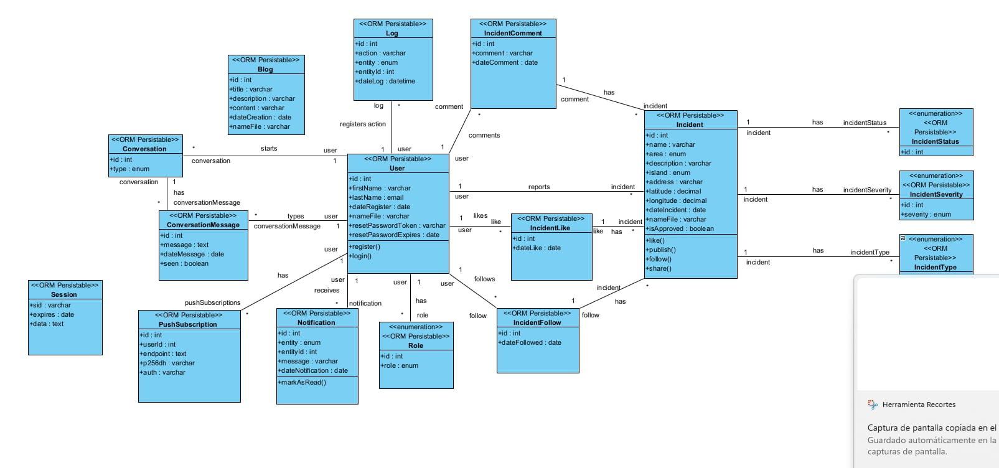
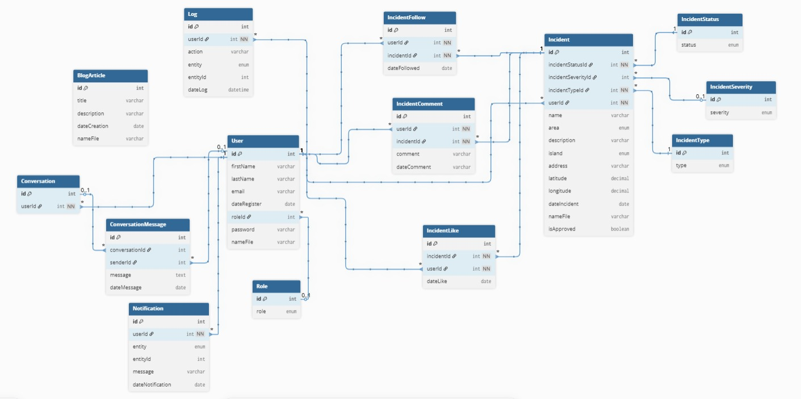

# System Diagrams

This document contains all the architectural and design diagrams for the CanAccesible project.

---

## Use Case Diagram

---

## Class Diagram

---

## Database Schema (ER Diagram)

The Entity-Relationship diagram shows the database structure and table relationships.

---

## Table Assignment by Team

| Team | Tables |
|------|--------|
| **Jonathan** | User, Role, Notification, IncidentComment |
| **Iriome** | Incident, IncidentStatus, IncidentType, IncidentSeverity, IncidentLike, IncidentFollow |
| **Carlos** | Conversation, ConversationMessage, BlogArticle, Log |