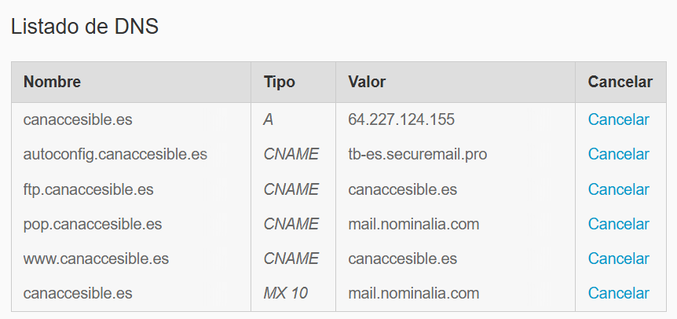

# Domain, DNS & SSL Configuration Guide

This document details the technical process for domain acquisition, DNS record configuration, Nginx reverse proxy setup, and SSL certificate implementation for the **CanAccesible** project.

---

## Domain Configuration

### Acquisition

The domain **`canaccesible.es`** was acquired through the registrar **Nominalia**.

### DNS Configuration

To link the domain with the server, the DNS records were configured in the **Nominalia Control Panel**.

**Steps taken in Nominalia:**
1.  Accessed the **Domain Management** section for `canaccesible.es`.
2.  Navigated to **DNS & Name Servers** > **DNS Zone Management**.
3.  Added/Modified the **A Record** to point to the DigitalOcean Droplet:
    *   **Host/Name:** `@` (represents the root domain `canaccesible.es`)
    *   **Type:** `A`
    *   **Value/Destination:** `[DROPLET_IP]` (The public IP address of the DigitalOcean Droplet)
    *   **TTL:** Default (usually 1 hour or 3600 seconds)
4.  Ensured **NS Records (Name Servers)** are set to Nominalia's default servers to allow management via their panel.

> **Note on Propagation:** DNS changes are not instantaneous. They typically take between **5 minutes and 24 hours** to propagate globally.



---

## Application Configuration

Before setting up the web server, the application code needs to be updated to accept requests from the new domain.

### Frontend (Vite)

To allow the application to accept requests forwarded by Nginx (which originate from the domain), the `vite.config.js` file was updated:

```javascript
server: {
    host: true,
    allowedHosts: ['canaccesible.es', 'www.canaccesible.es', 'localhost']
}
```

### Backend (CORS)

To allow the frontend (now running on `https://canaccesible.es`) to communicate with the backend, the **CORS (Cross-Origin Resource Sharing)** configuration in `backend/index.js` must be updated.

**Change:**
Update the `Access-Control-Allow-Origin` header to allow the production domain.

```javascript
app.use((req, res, next) => {
  const allowedOrigins = ['http://localhost:5173', 'https://canaccesible.es', 'https://www.canaccesible.es'];
  const origin = req.headers.origin;
  if (allowedOrigins.includes(origin)) {
    res.setHeader('Access-Control-Allow-Origin', origin);
  }
  // ... existing headers ...
  next();
});
```

---

## Nginx Web Server Setup

### Infrastructure Context

The application is deployed on a **DigitalOcean Droplet** running **Ubuntu (Linux)**. To serve the application and handle domain requests, **Nginx** is used as the web server.

### Installation

**Nginx** is a high-performance web server that can also act as a reverse proxy, load balancer, and HTTP cache.

**Installation Commands:**
```bash
sudo apt update
sudo apt install nginx
```

---

## Reverse Proxy Implementation

### Concept

A **Reverse Proxy** is a server that sits in front of web servers and forwards client requests to those web servers. In this architecture, Nginx accepts traffic on port 80 (HTTP) and 443 (HTTPS) and forwards it to the Vite development server running internally on port 5173.

**Why is it necessary?**
*   **Port Hiding (User Experience):** It allows users to access the application via the standard domain (`canaccesible.es`) without needing to append the development port `:5173` to the URL.
*   **Security:** It hides the internal topology of the network.
*   **SSL Termination:** Nginx handles HTTPS encryption/decryption, offloading this work from the application.

### Initial Configuration (HTTP)

The following configuration was created in `/etc/nginx/sites-available/canaccesible.es`. This configuration tells Nginx to:
1.  Forward root traffic (`/`) to the **Vite development server** (port 5173).
2.  Forward API traffic (`/api`) to the **Backend server** (port 85).

```nginx
server {
    listen 80;
    server_name canaccesible.es www.canaccesible.es;

    # Frontend (Vite)
    location / {
        proxy_pass http://127.0.0.1:5173;
        proxy_set_header Host $host;
        proxy_set_header X-Real-IP $remote_addr;
        proxy_set_header X-Forwarded-For $proxy_add_x_forwarded_for;
        proxy_set_header Upgrade $http_upgrade;
        proxy_set_header Connection "upgrade";
    }

    # Backend (API)
    location /api {
        proxy_pass http://127.0.0.1:85;
        proxy_set_header Host $host;
        proxy_set_header X-Real-IP $remote_addr;
        proxy_set_header X-Forwarded-For $proxy_add_x_forwarded_for;
    }
}
```

**Activating the Configuration:**

To enable this site, a symbolic link was created in the `sites-enabled` directory, and the default configuration was removed to avoid conflicts:

```bash
# Enable the new site (specifying destination folder is safer)
sudo ln -s /etc/nginx/sites-available/canaccesible.es /etc/nginx/sites-enabled/

# Remove the default site (Critical to avoid 404 errors)
sudo rm /etc/nginx/sites-enabled/default

# Restart Nginx
sudo systemctl restart nginx
```

### Directive Explanation

*   `listen 80;`: Listens for incoming connections on port 80 (standard HTTP).
*   `server_name ...;`: Specifies the domain names this block responds to.
*   `proxy_pass http://127.0.0.1:5173;`: Forwards the request to the local Vite server.
*   `proxy_set_header Host $host;`: Passes the original `Host` header to the backend.
*   `proxy_set_header X-Real-IP ...;`: Passes the client's real IP address to the backend (useful for logging and security).

---

## Conflict Resolution: Apache vs. Nginx

### Problem Identification

During the initial startup of Nginx, an error occurred because **Port 80 was already in use**.
*   **Diagnosis:** The command `lsof -i :80` revealed that **Apache2** was running.

### Resolution

To allow Nginx to bind to port 80, Apache had to be stopped and disabled.

**Commands Executed:**
```bash
# Stop the Apache service
sudo systemctl stop apache2

# Disable Apache from starting on boot
sudo systemctl disable apache2

# Verify port 80 is free
sudo lsof -i :80

# Start Nginx
sudo systemctl start nginx
```

---

## SSL/TLS Security (HTTPS)

To ensure secure communication, an SSL certificate was installed using **Let's Encrypt**.

### Tools

*   **Let's Encrypt:** A non-profit Certificate Authority (CA) that provides free X.509 certificates for TLS encryption.
*   **Certbot:** An open-source software tool for automatically using Let's Encrypt certificates to enable HTTPS.

### Installation and Configuration

First, install Certbot and the Nginx plugin:

```bash
sudo apt install certbot python3-certbot-nginx -y
```

Then, request and install the certificate automatically:

```bash
sudo certbot --nginx -d canaccesible.es -d www.canaccesible.es
```

**What Certbot did:**
1.  **Validation:** Verified control over the domain `canaccesible.es`.
2.  **Issuance:** Obtained a signed certificate from Let's Encrypt.
3.  **Installation:** Automatically modified the Nginx configuration to use the certificate.
4.  **Redirection:** Configured a 301 redirect to force all HTTP traffic to HTTPS.

**Actual configuration automatically appended by Certbot to the Nginx file:**

```nginx
    # ... inside the main server block ...

    # Configuración SSL (Certbot)
    listen 443 ssl;
    ssl_certificate /etc/letsencrypt/live/canaccesible.es/fullchain.pem;
    ssl_certificate_key /etc/letsencrypt/live/canaccesible.es/privkey.pem;
    include /etc/letsencrypt/options-ssl-nginx.conf;
    ssl_dhparam /etc/letsencrypt/ssl-dhparams.pem;

# Redirección HTTP -> HTTPS
server {
    if ($host = www.canaccesible.es) {
        return 301 https://$host$request_uri;
    }
    if ($host = canaccesible.es) {
        return 301 https://$host$request_uri;
    }
    listen 80;
    server_name canaccesible.es www.canaccesible.es;
    return 404;
}
```

### Certificate Details

*   **Location:** Certificates are stored in `/etc/letsencrypt/live/canaccesible.es/`.
*   **Renewal:** Certbot sets up a timer/cron job to automatically renew certificates before they expire (every 90 days).

---

## Final Verification

After all configurations, the service status was verified:

```bash
# Check Nginx syntax
sudo nginx -t

# Restart Nginx to apply changes
sudo systemctl restart nginx
```

The application is now accessible via **`https://canaccesible.es`**.