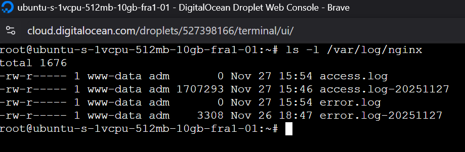

# Logging System & Rotation Policies

This document details the comprehensive logging strategy implemented in the **CanAccesible** platform. It covers both server-level logging (NGINX) and application-level logging (Database), including rotation policies, critical action tracking, and management interfaces.

---

## Server-Level Logging (NGINX)

**NGINX** acts as the web server and reverse proxy. It automatically generates logs for monitoring traffic and debugging server issues.

### Log Types
*   **`access.log`**: Records every client request (IP, URL, Status Code, User-Agent).
*   **`error.log`**: Records server issues, configuration errors, and upstream failures.

### Rotation Policy (Logrotate)
To prevent disk saturation, we use the system utility `logrotate`.

**Configuration (`/etc/logrotate.d/nginx`):**
```nginx
/var/log/nginx/*.log {
    daily
    dateext
    missingok
    rotate 14
    compress
    delaycompress
    notifempty
    create 0640 www-data adm
    sharedscripts
    postrotate
        systemctl reload nginx > /dev/null 2>&1 || true
    endscript
}
```

**Key Settings:**
*   **Frequency:** Daily rotation.
*   **Retention:** Keeps the last **14 days** of logs.
*   **Compression:** Old logs are compressed (`gzip`) to save space.
*   **Naming:** Rotated files use date extensions (e.g., `access.log-20251127`).

### Manual Testing & Verification

To verify the configuration without waiting for the daily cron job, a manual rotation can be forced.

**Command:**
```bash
sudo logrotate -f /etc/logrotate.d/nginx
```

*   **`-f` (force):** Tells logrotate to perform the rotation even if the criteria (like `daily`) haven't been met yet.

**Verification Steps:**
1.  Run `ls -l /var/log/nginx` before the command.
2.  Execute the force command.
3.  Run `ls -l /var/log/nginx` again.
4.  **Expected Result:** You should see a new set of rotated files (e.g., `access.log.1` or with a new date stamp) and the main `access.log` should be reset to size 0.

### Analysis of Log Status

The following output from `ls -l /var/log/nginx` demonstrates a successful rotation event (after performing the manual test or waiting for the daily job):



---

## Application-Level Logging (Database)

The application maintains a detailed audit trail of critical user actions within the database. This allows administrators to track security events and data modifications.

### Logged Actions

The system automatically records the following critical events:
*   **Authentication:** Login, Logout.
*   **User Management:** User creation, updates, deletion.

### Database Structure (`Logs` Table)

Each log entry contains:
*   **User:** Who performed the action.
*   **Action:** Description of the event.
*   **Entity:** The type of object affected.
*   **Entity ID:** The specific ID of the affected object.
*   **Date:** Timestamp of the event.

### Rotation Policy (Node-Cron)

To maintain database performance and manage storage, we implemented an automated cleanup service within the backend.

**Implementation:**
*   **Tool:** `node-cron` library.
*   **Service:** `backend/services/logCleanup.service.js`.
*   **Schedule:** Runs daily at **00:00 (Midnight)**.
*   **Retention Policy:** Deletes logs older than **30 days** (configurable via `LOG_RETENTION_DAYS`).

**Code Snippet:**
```javascript
cron.schedule('0 0 * * *', async () => {
    const retentionDays = 30;
    // ... logic to delete logs older than retentionDays
});
```

---

## Production Log Management

In the production environment (deployment), logs are distributed between services. This is how to access them for debugging:

### Backend Logs (Node.js)

The backend runs under **PM2**. To view real-time logs from the application (including API errors, database queries, and general output):

```bash
# View all logs
pm2 logs

# View specific process logs (usually 'index' or 'app')
pm2 logs index
```

### OpenLDAP Logs

The LDAP server runs as a **Docker container**, not under PM2. authentication and user creation logs are found here:

```bash
# View OpenLDAP container logs
docker logs openldap

# Follow logs in real-time
docker logs -f openldap
```

### Frontend Logs

Since the frontend is a static application served by NGINX:
*   **Client-side errors:** Visible only in the user's browser console (F12).
*   **Serving errors (404, 500):** Check NGINX logs (`/var/log/nginx/error.log`).

---

## Log Management Dashboard

Administrators have access to a dedicated interface to view and analyze application logs.

**Location:** Admin Dashboard -> **Registro de Actividad**